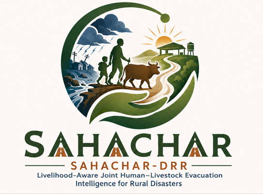
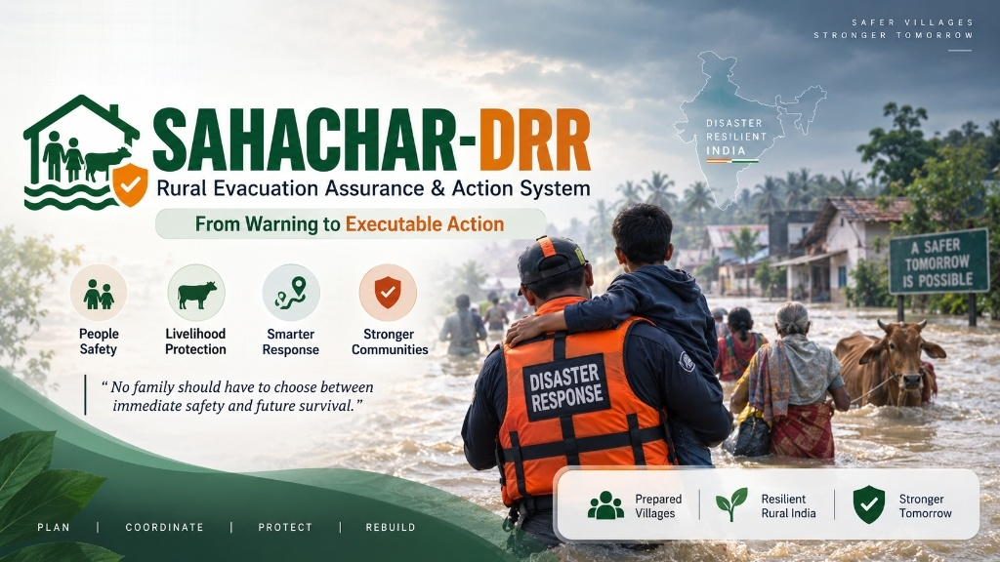
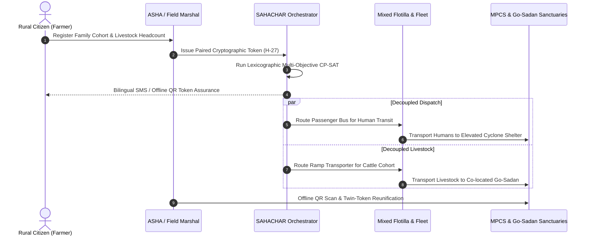
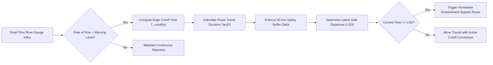

<p align="center">
  
</p>

<h1 align="center">🛡️ SAHACHAR (सहचार / ସହଚାର)</h1>

<p align="center">
  
  
  
  
  
  
</p>

<p align="center">
  <strong>"No Family Left Behind. No Cattle Abandoned."</strong><br>
  <em>Rural Evacuation Assurance, Decoupled Livestock Co-Transport & Autonomous Ground Fleet Orchestration System.</em>
</p>

---

> [!IMPORTANT]
> ### 📐 Repository Scope: System Architecture & Structural Framework
> **This repository presents the system architecture, mathematical formulations, and structural design for SAHACHAR-DRR.**
> 
> * **Notice**: Only the architectural layout, structural specifications, and conceptual framework are published in this repository.
> * **Implementation Notice**: No active execution code, backend runtime engines, or operational pipelines are currently published on GitHub. Production modules and live solver services are maintained under private deployment.

---

## 📌 Table of Contents

- [Overview](#-overview)
- [The Real-World Problem](#-the-real-world-problem)
- [System Preview](#-system-preview)
- [The 4 Pillars of Rural Resilience](#-the-4-pillars-of-rural-resilience)
- [Operational Viewports](#-operational-viewports)
- [Mathematical Optimization & Routing Engine](#-mathematical-optimization--routing-engine)
- [System Architecture & Dataflow Diagrams](#-system-architecture--dataflow-diagrams)
- [Operational Mission Lifecycle & Protocol](#-operational-mission-lifecycle--protocol)
- [Field Deployment & Offline Resilience](#-field-deployment--offline-resilience)
- [Repository Structure & Scope](#-repository-structure--scope)
- [Contributing](#-contributing)
- [License & Author](#-license--author)

---

## 📖 Overview

During extreme monsoon surges and cyclone landfalls, coastal regions face sudden inundation across deltaic river networks (such as the **Kendrapara basin and Brahmani-Baitarani delta in Odisha, India**). While early warning agencies provide accurate hazard forecasts, ground evacuation execution repeatedly encounters severe systemic friction:

1. **Evacuation Hesitation**: Families stay behind in mud (kutcha) dwellings because relief shelters traditionally prohibit cattle and goats.
2. **Hydrological Inundation Traps**: Siphon culverts and submerged low-bridges (such as the Paika River Bridge) cut off evacuation routes prematurely, trapping rescue vehicles without turning space.
3. **Telecommunication Blackouts**: Telecom tower submergence leaves rescue drivers, frontline healthcare cadres, and villagers in an information void without proof of shelter space.

**SAHACHAR-DRR** replaces uncertainty with a deterministic, constraint-satisfying ground orchestration architecture that treats people, livestock, routes, and shelters as an interconnected optimization network.

---

## ⚠️ The Real-World Problem

```
┌────────────────────────────────────────────────────────────────────────────────────────┐
│                        WHY TRADITIONAL EVACUATIONS COLLAPSE                            │
├───────────────────────────────┬───────────────────────────────┬────────────────────────┤
│   01. The Abandonment Paradox │  02. The Shortcut Cutoff Trap │ 03. The Information    │
│                               │                               │     Void               │
├───────────────────────────────┼───────────────────────────────┼────────────────────────┤
│ • For smallholders, cows are  │ • Standard GPS routes convoys │ • Cell towers drown;   │
│   their bank account.         │   via shortest path (R1).     │   sirens trigger blind │
│ • 84% refuse rescue when      │ • Low culverts submerge hours │   stampedes.           │
│   animals are banned.         │   before flood crests.        │ • No proof that beds   │
│ • Families drown guarding     │ • Buses get trapped without   │   or fodder exist at   │
│   their cattle shed.          │   turning radius.             │   the destination.     │
├───────────────────────────────┼───────────────────────────────┼────────────────────────┤
│ 💡 SAHACHAR FIX:              │ 💡 SAHACHAR FIX:              │ 💡 SAHACHAR FIX:       │
│ Twin-Token Decoupled Ramp     │ Predictive Access Horizon &   │ Offline LoRa Mesh &    │
│ Trucks (T-07) + Go-Sadans     │ Dijkstra Rerouting (Route R3) │ Bilingual SMS (H-27)   │
└───────────────────────────────┴───────────────────────────────┴────────────────────────┘
```

---

## 📸 System Preview

### Tactical Operational Theater & Convoy Radar


### Key Metrics Tracked in Real Time
| Metric | Value | Operational Context |
|---|---|---|
| **Citizens Tracked** | `428 / 428` | 100% Evacuation Quota fulfilled |
| **Livestock Secured** | `194 / 194` | Zero cattle or goats abandoned |
| **Panchayats Covered** | `12 Gram Panchayats` | Tirtol & Paika delta corridor |
| **Telemetry Gauges** | `14 Online Gauges` | Real-time river level monitoring stations |
| **Human & Animal Casualties** | `0 (Zero)` | Zero family-livestock separation |
| **Safety Buffer Margin** | `+38.5 min` | Pre-submergence route clearance |

---

## 🏛️ The 4 Pillars of Rural Resilience

### 👥 1. People Safety (Vulnerable Cohort First)
- Geocoded frontline synchronization with community health workers.
- High-priority departure slots for **expectant mothers, infants, and bedridden elders**.
- Dedicated passenger buses providing direct, transfer-free transit to Multi-Purpose Cyclone Shelters (MPCS).

### 🐄 2. Livelihood Protection (Twin-Token Decoupled Transport)
- Solves the abandonment paradox by decoupling humans and cattle into specialized, parallel transports.
- Human passengers board passenger buses; heavy dairy cattle board hydraulic ramp trucks.
- Animals are transported directly to elevated **Go-Sadan sanctuaries** stocked with dry fodder, potable water, and veterinary doctors.
- Matching physical wristbands, ear tags, and SMS tokens (`H-27`) guarantee families are reunited at destination hubs.

### 🛣️ 3. Smarter Response (Predictive Access Horizon)
- Replaces static navigation with hydrological edge-clearance calculations.
- Models gauge rates of rise (e.g., Paika River gauge rising at $0.18\text{ m/hr}$, warning level $10.8\text{ m}$, danger level $11.5\text{ m}$).
- Detects Paika Bridge cutoff at $13:05$ hrs well before water overtops the deck and dynamically switches convoys to elevated embankment routes (+38.5 min buffer).

### 🛡️ 4. Stronger Communities (Offline Mesh & Trust Assurance)
- Designed to operate during total power grid and cellular network failure.
- Cryptographically signed QR tokens scan offline on standard mobile browsers.
- Local field intake checkpoints buffer data in memory and sync peer-to-peer via **LoRa mesh radio packets**.
- Bilingual notifications in **Odia (ଓଡ଼ିଆ)** and **English**.

---

## 🖥️ Operational Viewports

SAHACHAR specifies four synchronized interfaces tailored for every stakeholder in the disaster management chain of command:

```
                  ┌──────────────────────────────────────────────┐
                  │          SAHACHAR APPLICATION CORE          │
                  └──────────────────────┬───────────────────────┘
                                         │
         ┌───────────────────┬───────────┴───────────┬───────────────────┐
         ▼                   ▼                       ▼                   ▼
┌──────────────────┐┌──────────────────┐┌──────────────────┐┌──────────────────┐
│  MISSION CONTROL ││ DRIVER COCKPIT   ││ CITIZEN SOS PASS ││ FIELD MARSHAL    │
│  (SEOC RADAR)    ││ (TACTICAL HUD)   ││ (TOKEN H-27)     ││ (CHECKPOINT INTAKE│
├──────────────────┤├──────────────────┤├──────────────────┤├──────────────────┤
│• MapLibre GIS Map││• Turn-by-Turn Nav││• Family & Cattle ││• QR Scanner      │
│• River Gauges    ││• Submergence     ││  Reservation Pass││• Offline Intake  │
│• Fleet Spine     ││  Countdown       ││• Safe Haven GPS  ││  Queue           │
│• Solver Trigger  ││• Edge Warnings   ││• Bilingual Odia  ││• LoRa Peer Sync  │
│• OSDMA Escalation││• Offline Audio   ││• SMS Fallback    ││• Capacity Tally  │
└──────────────────┘└──────────────────┘└──────────────────┘└──────────────────┘
```

### 1. SEOC Mission Control Radar
The primary situational awareness desk for District Collectors and Emergency Operations Centers:
- Vector GIS map with multi-hazard layers: flood inundation polygons, road edge threat states (`OPEN`, `CONDITIONAL`, `BLOCKED`, `THREATENED`), settlement pins, shelters, and Go-Sadans.
- Telemetry monitoring vehicle coordinates, speed, mission status, and passenger loads.
- Visual execution spine displaying each phase of evacuation in real time.

### 2. Driver Telemetry Cockpit
Dedicated tactical cockpit designed for high-water ramp livestock carriers and bus drivers:
- Displays critical bridge submergence countdown timers (`Paika Bridge Closes in 42m`).
- Real-time speedometer, distance to pickup, and waypoint telemetry.
- Dynamic route reroute alerts instructing the driver to avoid low-lying culverts.

### 3. Citizen SOS Assurance Pass (Twin-Token H-27)
Mobile pass designed for rural heads of household:
- Unifies family passenger boarding details with paired cattle carrier identification.
- Confirms allocated beds at the cyclone shelter and reserved cattle stall numbers at Go-Sadan.
- Works offline via cached SMS/PWA token with QR validation code.

### 4. Field Marshal Intake Audit
Frontline intake tool for shelter managers and village disaster volunteers:
- High-speed offline QR verification of arriving citizens and livestock.
- Real-time shelter occupancy counter against maximum capacity.
- Buffers arrivals locally and synchronizes over LoRa mesh.

---

## 🧮 Mathematical Optimization & Routing Engine

SAHACHAR formulates disaster evacuation as a **Multi-Objective Constrained Vehicle Routing Problem with Time-Dependent Edge Traversal (MOC-VRPTW)**, solved using **Google OR-Tools CP-SAT**:

### 1. Access Horizon Formulation
For any road edge $e \in E$, let $H_e(t)$ represent water depth over the roadway and $H_{crit}$ the maximum fordable water depth for vehicle class $v$. The edge cutoff time $T_{cutoff}(e)$ is:

$$T_{cutoff}(e) = \inf \{ t \ge t_0 \mid H_e(t) \ge H_{crit}(v) \}$$

The **Latest Safe Departure (LSD)** for a convoy traversing a path $P = (e_1, e_2, \dots, e_k)$ is defined as:

$$LSD(P) = \min_{i \in \{1,\dots,k\}} \left( T_{cutoff}(e_i) - \sum_{j=1}^{i} \tau(e_j) - \Delta_{buffer} \right)$$

where $\tau(e_j)$ is edge travel duration and $\Delta_{buffer}$ is a mandatory 30-minute humanitarian safety margin.

### 2. Lexicographic Multi-Objective Hierarchy
The CP-SAT solver optimizes a 4-tier lexicographic objective function where safety constraints strictly supersede secondary efficiencies:

$$\max \mathcal{F} = \Big\langle f_1(\mathbf{x}),\, f_2(\mathbf{x}),\, f_3(\mathbf{x}),\, f_4(\mathbf{x}) \Big\rangle$$

1. **Tier 1 — Vulnerable Humans Priority ($f_1$)**:
   $$\max \sum_{i \in \text{Vulnerable}} \sum_{v \in V} x_{i, v, t_0}$$
   Guarantees expectant mothers, infants, and bedridden elders are assigned the earliest departure slots ($t_0$).
2. **Tier 2 — Total Human Evacuation Completion ($f_2$)**:
   $$\max \sum_{i \in \text{Humans}} \sum_{v \in V_{\text{Passenger}}} x_{i, v}$$
   Ensures 100% of human settlement quotas are allocated to buses before cutoffs.
3. **Tier 3 — Safety Margin Maximization ($f_3$)**:
   $$\max \min_{v \in V} \left( T_{cutoff}(P_v) - T_{arrival}(P_v) \right)$$
   Maximizes temporal clearance between convoy crossing and edge submersion.
4. **Tier 4 — Decoupled Livestock Protection ($f_4$)**:
   $$\max \sum_{j \in \text{Livestock}} \sum_{u \in V_{\text{Carrier}}} y_{j, u}$$
   Synchronizes cattle transportation to eliminate the abandonment paradox.

### 3. Hard Constraints Enforced
- **Vehicle Floor Area & Weight Capacity**: $\sum_j \text{Area}(j) \cdot y_{j,u} \le \text{FloorLimit}(u)$
- **Non-Mixing Invariant**: Human passengers and heavy livestock cannot occupy the same vehicle chassis.
- **Twin-Token Coupling Invariant**: A family token $H_k$ and livestock token $C_k$ must terminate at co-located or linked safe shelters.
- **Stability-Aware Adaptive Replanning**: When a disruption occurs at time $t_d$, all completed and in-transit sorties are frozen ($\mathbf{x}_{completed} = \text{const}$), replanning only affected downstream sorties.

---

## 🧠 System Architecture & Dataflow Diagrams

### 1. End-to-End System Architecture


### 2. Decoupled Co-Evacuation & Twin-Token Dataflow



### 3. Access Horizon Dynamic Cutoff Calculation Flow



---

## 🔄 Operational Mission Lifecycle & Protocol

The operational protocol defines the step-by-step lifecycle of ground response during an active flood hazard alert:

```
[PHASE 0] SYSTEM INITIALIZATION
   │  Corridor calibration & hydrological baseline ingestion
   ▼
[PHASE 1] COGNITIVE RISK ASSESSMENT
   │  Vulnerability mapping & identification of evacuation refusal risks
   ▼
[PHASE 2] MULTI-TIER DECOUPLED DISPATCH
   │  Parallel scheduling of passenger transport and livestock carriers
   ▼
[PHASE 3] ACCESS HORIZON MONITORING
   │  Dynamic road edge cutoff tracking and safety margin buffers
   ▼
[PHASE 4] MULTI-OBJECTIVE CONSTRAINT OPTIMIZATION
   │  Hierarchical lexicographic assignment (Vulnerable Humans → Assisted Transit → Margin → Livestock)
   ▼
[PHASE 5] OPERATIONAL AUTHORIZATION & TRANSIT
   │  Officer sign-off and live route execution monitoring
   ▼
[PHASE 6] STABILITY-AWARE ADAPTIVE REPLANNING
   │  Disruption detection, sortie freezing, and dynamic rerouting
   ▼
[PHASE 7] RESOURCE DEFICIT ESCALATION
   │  Automated gap exposure and district resource requisition
   ▼
[PHASE 8] 100% SANCTUARIES ASSURED
      Full evacuation quota secured with zero family-livelihood separation
```

---

## 📡 Field Deployment & Offline Resilience

SAHACHAR was designed specifically for severe infrastructure breakdown:

1. **Edge Execution Architecture**: All routing mathematics and optimization algorithms are formulated for client-side evaluation to ensure zero dependency on external cloud services during blackouts.
2. **Offline Web Storage**: Map vectors, settlement census figures, vehicle rosters, and evacuation paths are designed for local browser caching via Progressive Web App (PWA) specifications.
3. **Signed QR Token Verification**: Citizen evacuation passes (`H-27`) utilize HMAC signatures that checkpoint field marshals verify locally without active internet connectivity.
4. **LoRa Mesh Broadcast**: Checkpoint intake numbers synchronize over low-power LoRa transceivers between field shelters and the sub-divisional EOC.

---

## 📐 Repository Structure & Scope

This repository houses the **System Architecture, Structural Specifications, and Conceptual Blueprint** for **SAHACHAR-DRR**.

### Current Repository Status
- ✅ **Cinematic Booting Sequence & Landing Portal**: Active & interactive
- ✅ **System Architecture & Dataflow Diagrams**: Fully specified
- ✅ **Mathematical Formulations & Objective Hierarchy**: Defined (CP-SAT & Access Horizon)
- 🔒 **Tactical Command Surfaces (SEOC Radar, Driver Telemetry, Citizen SOS)**: Feature Coming Soon (active deployment)

### 🚀 Running the Live Portal Preview
To preview the interactive Booting Sequence and Landing Portal locally:

```bash
# 1. Install dependencies
npm install

# 2. Run local development preview
npm run dev
```
👉 The portal will launch at `http://localhost:5173`.

---

## 🤝 Contributing

Contributions to the architectural specifications and mathematical models are welcome! Please follow standard open-source workflows:

1. **Fork the Repository**
2. **Create a Specification Branch**:
   ```bash
   git checkout -b spec/access-horizon-enhancement
   ```
3. **Commit Your Changes**:
   ```bash
   git commit -m "docs(spec): refine CP-SAT turnaround slack bound formulation"
   ```
4. **Push to Your Branch**:
   ```bash
   git push origin spec/access-horizon-enhancement
   ```
5. **Open a Pull Request**

---

## 📜 License & Author

Developed by **[Mumuksh Jain](https://github.com/Mumuksh-Jain)** (`mumukshujain2466@gmail.com`) for Disaster Risk Reduction (DRR) and coastal flood mitigation initiatives.

Distributed under the **MIT License**. See `LICENSE` for more information.

---

⭐ **If you believe in zero-casualty disaster response and ethical animal protection, please star this repository!**
