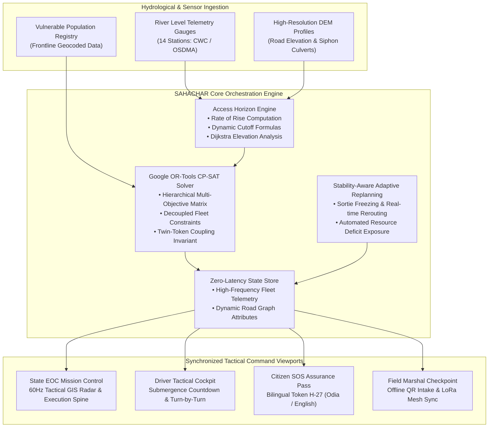
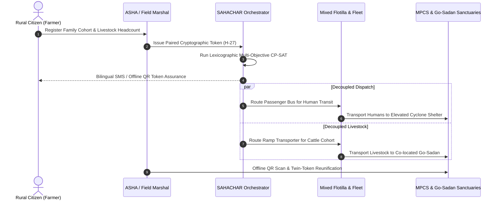
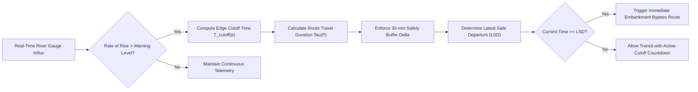

# 🛡️ SAHACHAR (सहचार / ସହଚାର)

       

> **"No Family Left Behind. No Cattle Abandoned."**  
> *Rural Evacuation Assurance, Decoupled Livestock Co-Transport & Autonomous Ground Fleet Orchestration System.*

---

## 📌 Executive Summary

**SAHACHAR-DRR** is an evidence-bound disaster risk reduction and evacuation orchestration platform engineered for coastal and deltaic flood corridors (modeled on the **Kendrapara basin and Brahmani-Baitarani delta in Odisha, India**).

Traditional disaster response often falters because broadcast sirens and generic evacuation directives ignore rural socio-economic realities: smallholder farmers refuse to evacuate when instructed to abandon their dairy cattle—their sole generational asset and economic livelihood. Concurrently, standard navigation services route heavy rescue fleets along shortest paths that become submerged hours before peak flood crests.

SAHACHAR bridges the fatal gap between early hydrological warning and verifiable ground rescue through **Twin-Token decoupled co-evacuation**, **predictive Access Horizon calculations**, and **Google OR-Tools CP-SAT multi-objective optimization**.

The platform enables disaster management authorities, frontline officers, transport teams, and citizens to:
- Orchestrate multi-tier vehicle fleets (passenger buses, high-water ramp livestock carriers, emergency jet-boats)
- Pair family members and livestock with cryptographically verified **Twin-Tokens (H-27)**
- Calculate dynamic **Latest Safe Departure (LSD)** windows based on river gauge hydrographs before low-lying bridges submerge
- Solve complex vehicle allocation and priority dispatch via hierarchical constraint programming
- Execute **stability-aware adaptive replanning (Plan V2)** during active bridge breaches or vehicle breakdowns
- Guarantee **100% offline resilience** via signed QR credentials and peer-to-peer LoRa mesh synchronization
- Command operations across **4 synchronized tactical viewports**: SEOC Mission Control Radar, Driver Telemetry Cockpit, Citizen SOS Assurance, and Field Marshal Intake Audit

---

## 📌 Table of Contents

- [Overview](#-overview)
- [The Real-World Problem](#-the-real-world-problem)
- [System Preview](#-system-preview)
- [The 4 Pillars of Rural Resilience](#-the-4-pillars-of-rural-resilience)
- [Operational Viewports](#-operational-viewports)
- [Mathematical Optimization & Routing Engine](#-mathematical-optimization--routing-engine)
- [Tech Stack](#-tech-stack)
- [System Architecture & Dataflow Diagrams](#-system-architecture--dataflow-diagrams)
- [Setup & Installation](#-setup--installation)
- [Interactive Simulation & Mission Lifecycle](#-interactive-simulation--mission-lifecycle)
- [Field Deployment & Offline Resilience](#-field-deployment--offline-resilience)
- [Contributing](#-contributing)
- [License & Author](#-license--author)

---

## 📖 Overview

During extreme monsoon surges and cyclone landfalls, coastal regions face sudden inundation across deltaic river networks. While agencies like OSDMA, CWC, and IMD provide accurate early warnings, last-mile execution repeatedly encounters systemic friction:

1. **Evacuation Hesitation**: Families stay behind in mud (kutcha) dwellings because relief shelters traditionally prohibit cattle and goats.
2. **Hydrological Inundation Traps**: Siphon culverts and submerged low-bridges (such as the Paika River Bridge) cut off evacuation routes prematurely, trapping rescue vehicles without turning space.
3. **Telecommunication Blackouts**: Telecom tower submergence leaves rescue drivers, frontline healthcare cadres, and villagers in an information void without proof of shelter space.

**SAHACHAR-DRR** replaces uncertainty with a deterministic, constraint-satisfying ground orchestration engine that treats people, livestock, routes, and shelters as an interconnected optimization network.

---

## ⚠️ The Real-World Problem

```
┌────────────────────────────────────────────────────────────────────────────────────────┐
│                        WHY TRADITIONAL EVACUATIONS COLLAPSE                            │
├───────────────────────────────┬───────────────────────────────┬────────────────────────┤
│   01. The Abandonment Paradox │  02. The Shortcut Cutoff Trap │ 03. The Information    │
│                               │                               │     Void               │
├───────────────────────────────┼───────────────────────────────┼────────────────────────┤
│ • For smallholders, cows are  │ • Standard GPS routes convoys │ • Cell towers drown;   │
│   their bank account.         │   via shortest path (R1).     │   sirens trigger blind │
│ • 84% refuse rescue when      │ • Low culverts submerge hours │   stampedes.           │
│   animals are banned.         │   before flood crests.        │ • No proof that beds   │
│ • Families drown guarding     │ • Buses get trapped without   │   or fodder exist at   │
│   their cattle shed.          │   turning radius.             │   the destination.     │
├───────────────────────────────┼───────────────────────────────┼────────────────────────┤
│ 💡 SAHACHAR FIX:              │ 💡 SAHACHAR FIX:              │ 💡 SAHACHAR FIX:       │
│ Twin-Token Decoupled Ramp     │ Predictive Access Horizon &   │ Offline LoRa Mesh &    │
│ Trucks (T-07) + Go-Sadans     │ Dijkstra Rerouting (Route R3) │ Bilingual SMS (H-27)   │
└───────────────────────────────┴───────────────────────────────┴────────────────────────┘
```

---

## 📸 System Preview

### Tactical Operational Theater & Convoy Radar


### Key Metrics Tracked in Real Time
| Metric | Value | Operational Context |
|---|---|---|
| **Citizens Tracked** | `428 / 428` | 100% Evacuation Quota fulfilled |
| **Livestock Secured** | `194 / 194` | Zero cattle or goats abandoned |
| **Panchayats Covered** | `12 Gram Panchayats` | Tirtol & Paika delta corridor |
| **Telemetry Gauges** | `14 Online Gauges` | Real-time CWC/OSDMA river levels |
| **Human & Animal Casualties** | `0 (Zero)` | Zero family-livestock separation |
| **Safety Buffer Margin** | `+38.5 min` | Pre-submergence route clearance |

---

## 🏛️ The 4 Pillars of Rural Resilience

### 👥 1. People Safety (Vulnerable Cohort First)
- Geocoded frontline synchronization with community health workers.
- High-priority departure slots for **expectant mothers, infants, and bedridden elders**.
- Dedicated passenger buses providing direct, transfer-free transit to Multi-Purpose Cyclone Shelters (MPCS).

### 🐄 2. Livelihood Protection (Twin-Token Decoupled Transport)
- Solves the abandonment paradox by decoupling humans and cattle into specialized, parallel transports.
- Human passengers board passenger buses; heavy dairy cattle board hydraulic ramp trucks.
- Animals are transported directly to elevated **Go-Sadan sanctuaries** stocked with dry fodder, potable water, and veterinary doctors.
- Matching physical wristbands, ear tags, and SMS tokens (`H-27`) guarantee families are reunited at destination hubs.

### 🛣️ 3. Smarter Response (Predictive Access Horizon)
- Replaces static navigation with hydrological edge-clearance calculations.
- Models gauge rates of rise (e.g., Paika River gauge rising at $0.18\text{ m/hr}$, warning level $10.8\text{ m}$, danger level $11.5\text{ m}$).
- Detects Paika Bridge cutoff at $13:05$ hrs well before water overtops the deck and dynamically switches convoys to elevated embankment routes (+38.5 min buffer).

### 🛡️ 4. Stronger Communities (Offline Mesh & Trust Assurance)
- Operates during total power grid and cellular network failure.
- Cryptographically signed QR tokens scan offline on standard mobile browsers.
- Local field intake checkpoints buffer data in memory and sync peer-to-peer via **LoRa mesh radio packets**.
- Bilingual notifications in **Odia (ଓଡ଼ିଆ)** and **English**.

---

## 🖥️ Operational Viewports

SAHACHAR provides four synchronized interfaces tailored for every stakeholder in the disaster management chain of command:

```
                  ┌──────────────────────────────────────────────┐
                  │          SAHACHAR APPLICATION CORE          │
                  └──────────────────────┬───────────────────────┘
                                         │
         ┌───────────────────┬───────────┴───────────┬───────────────────┐
         ▼                   ▼                       ▼                   ▼
┌──────────────────┐┌──────────────────┐┌──────────────────┐┌──────────────────┐
│  MISSION CONTROL ││ DRIVER COCKPIT   ││ CITIZEN SOS PASS ││ FIELD MARSHAL    │
│  (SEOC RADAR)    ││ (TACTICAL HUD)   ││ (TOKEN H-27)     ││ (CHECKPOINT INTAKE│
├──────────────────┤├──────────────────┤├──────────────────┤├──────────────────┤
│• MapLibre GIS Map││• Turn-by-Turn Nav││• Family & Cattle ││• QR Scanner      │
│• River Gauges    ││• Submergence     ││  Reservation Pass││• Offline Intake  │
│• Fleet Spine     ││  Countdown       ││• Safe Haven GPS  ││  Queue           │
│• Solver Trigger  ││• Edge Warnings   ││• Bilingual Odia  ││• LoRa Peer Sync  │
│• OSDMA Escalation││• Offline Audio   ││• SMS Fallback    ││• Capacity Tally  │
└──────────────────┘└──────────────────┘└──────────────────┘└──────────────────┘
```

### 1. SEOC Mission Control Radar
The primary situational awareness desk for District Collectors and Emergency Operations Centers:
- Interactive vector map with multi-hazard layers: flood inundation polygons, road edge threat states (`OPEN`, `CONDITIONAL`, `BLOCKED`, `THREATENED`), settlement pins, shelters, and Go-Sadans.
- Live telemetry monitoring vehicle coordinates, speed, mission status, and passenger loads.
- Visual execution spine showing each phase of evacuation in real time.

### 2. Driver Telemetry Cockpit
Dedicated tactical cockpit designed for high-water ramp livestock carriers and bus drivers:
- Displays critical bridge submergence countdown timers (`Paika Bridge Closes in 42m`).
- Real-time speedometer, distance to pickup, and waypoint telemetry.
- Dynamic route reroute alerts instructing the driver to avoid low-lying culverts.

### 3. Citizen SOS Assurance Pass (Twin-Token H-27)
Mobile-first web pass accessible to rural heads of household:
- Unifies family passenger boarding details with paired cattle carrier identification.
- Confirms allocated beds at the cyclone shelter and reserved cattle stall numbers at Go-Sadan.
- Works offline via cached SMS/PWA token with QR validation code.

### 4. Field Marshal Intake Audit
Frontline intake tool for shelter managers and village disaster volunteers:
- High-speed offline QR verification of arriving citizens and livestock.
- Real-time shelter occupancy counter against maximum capacity.
- Zero cloud dependence: buffers arrivals locally and synchronizes over LoRa mesh.

---

## 🧮 Mathematical Optimization & Routing Engine

SAHACHAR formulates disaster evacuation as a **Multi-Objective Constrained Vehicle Routing Problem with Time-Dependent Edge Traversal (MOC-VRPTW)**, solved using **Google OR-Tools CP-SAT**:

### 1. Access Horizon Formulation
For any road edge $e \in E$, let $H_e(t)$ represent water depth over the roadway and $H_{crit}$ the maximum fordable water depth for vehicle class $v$. The edge cutoff time $T_{cutoff}(e)$ is:

$$T_{cutoff}(e) = \inf \{ t \ge t_0 \mid H_e(t) \ge H_{crit}(v) \}$$

The **Latest Safe Departure (LSD)** for a convoy traversing a path $P = (e_1, e_2, \dots, e_k)$ is defined as:

$$LSD(P) = \min_{i \in \{1,\dots,k\}} \left( T_{cutoff}(e_i) - \sum_{j=1}^{i} \tau(e_j) - \Delta_{buffer} \right)$$

where $\tau(e_j)$ is edge travel duration and $\Delta_{buffer}$ is a mandatory 30-minute humanitarian safety margin.

### 2. Lexicographic Multi-Objective Hierarchy
The CP-SAT solver optimizes a 4-tier lexicographic objective function where safety constraints strictly supersede secondary efficiencies:

$$\max \mathcal{F} = \Big\langle f_1(\mathbf{x}),\, f_2(\mathbf{x}),\, f_3(\mathbf{x}),\, f_4(\mathbf{x}) \Big\rangle$$

1. **Tier 1 — Vulnerable Humans Priority ($f_1$)**:
   $$\max \sum_{i \in \text{Vulnerable}} \sum_{v \in V} x_{i, v, t_0}$$
   Guarantees expectant mothers, infants, and bedridden elders are assigned the earliest departure slots ($t_0$).
2. **Tier 2 — Total Human Evacuation Completion ($f_2$)**:
   $$\max \sum_{i \in \text{Humans}} \sum_{v \in V_{\text{Passenger}}} x_{i, v}$$
   Ensures 100% of human settlement quotas are allocated to buses before cutoffs.
3. **Tier 3 — Safety Margin Maximization ($f_3$)**:
   $$\max \min_{v \in V} \left( T_{cutoff}(P_v) - T_{arrival}(P_v) \right)$$
   Maximizes temporal clearance between convoy crossing and edge submersion.
4. **Tier 4 — Decoupled Livestock Protection ($f_4$)**:
   $$\max \sum_{j \in \text{Livestock}} \sum_{u \in V_{\text{Carrier}}} y_{j, u}$$
   Synchronizes cattle transportation to eliminate the abandonment paradox.

### 3. Hard Constraints Enforced
- **Vehicle Floor Area & Weight Capacity**: $\sum_j \text{Area}(j) \cdot y_{j,u} \le \text{FloorLimit}(u)$
- **Non-Mixing Invariant**: Human passengers and heavy livestock cannot occupy the same vehicle chassis.
- **Twin-Token Coupling Invariant**: A family token $H_k$ and livestock token $C_k$ must terminate at co-located or linked safe shelters.
- **Stability-Aware Adaptive Replanning**: When a disruption occurs at time $t_d$, all completed and in-transit sorties are frozen ($\mathbf{x}_{completed} = \text{const}$), replanning only affected downstream sorties.

---

## 🛠 Tech Stack

### Frontend & UI Architecture
| Technology | Purpose |
|---|---|
| **React 19** | Reactive component architecture |
| **Vite 6** | Build tool and development server |
| **TypeScript 5** | Strict end-to-end type safety for mission-critical logic |
| **TailwindCSS 3.4** | High-performance tactical UI and dark-mode styling |
| **Framer Motion 13** | Hardware-accelerated transitions and telemetry animations |
| **Lucide React** | Tactical iconography system |

### GIS, Geolocation & Mapping
| Technology | Purpose |
|---|---|
| **MapLibre GL 6.7** | High-performance WebGL vector basemap engine |
| **React Map GL 8.1** | Reactive bindings for MapLibre map viewport |
| **Three.js** | 3D visual effects and spatial orientation rendering |

### State Management & Optimization
| Technology | Purpose |
|---|---|
| **Zustand 5** | Zero-latency atomic state management across viewports |
| **Deterministic Simulation Engine** | Discrete-event telemetry simulating vehicle routes and sensor feeds |
| **Access Horizon Engine** | Real-time Dijkstra graph analysis for dynamic road inundation |
| **Google OR-Tools CP-SAT** | Mathematical solver formulation for multi-objective vehicle routing |

---

## 🧠 System Architecture & Dataflow Diagrams

### 1. End-to-End System Architecture



### 2. Decoupled Co-Evacuation & Twin-Token Dataflow



### 3. Access Horizon Dynamic Cutoff Calculation Flow



**Key Architectural Decisions:**
- **Zero-Latency In-Memory State**: Atomic selectors guarantee 60 FPS GIS updates without unnecessary component re-renders.
- **Fail-Safe Offline Autonomy**: Graph models, census figures, and routing logic run entirely in client memory; network loss does not disrupt navigation.
- **Transparent Fault Exposure**: Rather than masking unmet vehicle demands, the engine generates an explicit **Resource Gap Alert** and triggers an administrative requisition for additional district vehicles.

---

## ⚙️ Setup & Installation

### Prerequisites
- **Node.js**: `v18.0.0` or higher
- **npm**: `v9.0.0` or higher (or `pnpm` / `yarn`)

### 1. Clone the Repository

```bash
git clone https://github.com/Mumuksh-Jain/SAHACHAR.git
cd SAHACHAR
```

### 2. Install Dependencies

```bash
npm install
```

### 3. Run Development Server

```bash
npm run dev
```

The application will start immediately at:
👉 **`http://localhost:5173`**

### 4. Build for Production

```bash
npm run build
```

To preview the optimized production build locally:

```bash
npm run preview
```

---

## 🎬 Interactive Simulation & Mission Lifecycle

SAHACHAR includes an automated **Full Demonstration Choreography Engine** that takes evaluators through a complete disaster response lifecycle:

```
[STAGE 0] SYSTEM BOOT (0:00 – 0:10)
   │  Cinematic initialization • Odisha Disaster Management Corridor
   ▼
[STAGE 1] THE HUMANITARIAN PROBLEM (0:10 – 0:35)
   │  The Abandonment Paradox: Why villagers refuse rescue when cattle are left behind
   ▼
[STAGE 2] MISSION CONTROL & DECOUPLED FLEET (0:35 – 1:05)
   │  Tirtol Corridor Radar: Human Bus & Livestock Trailer coordination
   ▼
[STAGE 3] ACCESS HORIZON ENGINE (1:05 – 1:35)
   │  Paika Bridge submergence detected (13:05 cutoff) vs Route R3 (+38 min margin)
   ▼
[STAGE 4] CONSTRAINT OPTIMIZATION — HUMAN FIRST (1:35 – 2:05)
   │  Google OR-Tools CP-SAT multi-objective hierarchical optimization modal
   ▼
[STAGE 5] AUTHORIZATION & LIVE TELEMETRY (2:05 – 2:30)
   │  Human-in-the-loop authorization • Live 60Hz telemetry of convoy crossing river
   ▼
[STAGE 6] FAILURE INJECTION & ADAPTIVE REPLANNING (2:30 – 3:05)
   │  Paika Bridge breached • Freeze completed sorties • Dynamic Dijkstra Plan V2
   ▼
[STAGE 7] RESOURCE GAP & OSDMA ESCALATION (3:05 – 3:30)
   │  Carrier breakdown • Expose 18 stranded cattle deficit • State requisition of T11
   ▼
[STAGE 8] 100% SANCTUARIES ASSURED (3:30 – 3:48)
      428/428 Citizens • 194/194 Cattle • 0 Casualties • Zero Family Separation
```

- **Interactive Virtual Cursor**: Guides viewer attention across UI buttons during automatic playback.
- **Bilingual Subtitles HUD**: Displays synchronized Hindi narrative with concise English operational summaries.
- **Stage Navigation Bar**: Jump directly to any stage (e.g. *Solver*, *Disruption*, *Escalation*) at any moment.

---

## 📡 Field Deployment & Offline Resilience

SAHACHAR was designed specifically for severe infrastructure breakdown:

1. **Client-Side Edge Execution**: All routing mathematics and simulation calculations execute directly inside the browser. Zero central cloud server latency.
2. **Offline Web Storage**: Map tiles, settlement census figures, vehicle rosters, and evacuation paths are cached in local browser storage via Progressive Web App (PWA) service workers.
3. **Signed QR Token Verification**: Citizen evacuation passes (`H-27`) contain an HMAC signature that checkpoint field marshals verify locally without internet connectivity.
4. **LoRa Mesh Broadcast**: Checkpoint intake numbers synchronize over low-power LoRa transceivers between field shelters and the sub-divisional EOC.

---

## 🤝 Contributing

Contributions are welcome! Please follow standard open-source workflows:

1. **Fork the Repository**
2. **Create a Feature Branch**:
   ```bash
   git checkout -b feature/access-horizon-enhancement
   ```
3. **Commit Your Changes**:
   ```bash
   git commit -m "feat(solver): improve CP-SAT turnaround slack bound"
   ```
4. **Push to Your Branch**:
   ```bash
   git push origin feature/access-horizon-enhancement
   ```
5. **Open a Pull Request**

---

## 📜 License & Author

Developed by **[Mumuksh Jain](https://github.com/Mumuksh-Jain)** (`mumukshujain2466@gmail.com`) for the **Smart India Hackathon (SIH)** Disaster Risk Reduction track and coastal flood mitigation initiatives.

Distributed under the **MIT License**. See `LICENSE` for more information.

---

⭐ **If you believe in zero-casualty disaster response and ethical animal protection, please star this repository!**
